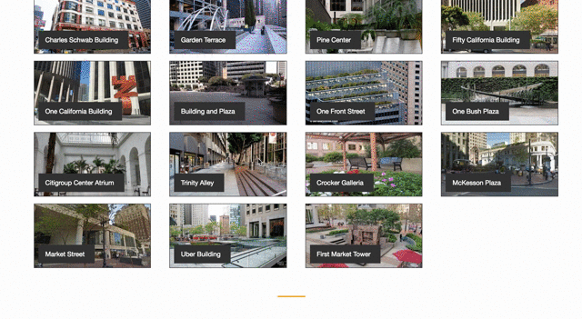

## Table of Contents

* [About](#about)
* [Technologies](#tech)
* [Development](#dev)
* [User Experience](#user)
* [Run Locally](#run)
* [Author](#author)

## About

Hidden Gems is a visual map for urban park lovers to discover nearby Privately-Owned Public Open Spaces (POPOS) in San Francisco.

### Wish List for v1.2
* [Locator > Map](https://www.mapbox.com/help/building-a-store-locator/#finished-product)
* Extending list of locations
* Lightbox jQuery library

## Technologies

[Python 2.7](https://www.python.org/ "Python")    | [Javascript](https://www.python.org/ "Javascript")
:----------- | -----------:
**[Flask](http://flask.pocoo.org/ "Flask")**           | **[jQuery](https://jquery.com/ "jQuery")**
**[SQLAlchemy](http://www.sqlalchemy.org/ "SQLAlchemy")**           | **[Bootstrap](http://getbootstrap.com/ "Bootstrap")**
| **[CSS](https://developer.mozilla.org/en-US/docs/Web/CSS "CSS")**       | **[Jinja2](http://jinja.pocoo.org/ "Jinja2")**

####**Dependencies -** [requirements.txt](README.md "Dependencies")

####**Test Coverage -** [90% unittest coverage](tests.py)

## User Experience

 

## Run Locally
### Flask App

Create a local directory to work within

	$ mkdir -p YOUR_DIRECTORY_NAME_HERE

Clone this repository and cd into it
	
	$ git clone https://github.com/aroseartist/Hidden-Gems YOUR_DIRECTORY_NAME_HERE
	
	$ cd ~/YOUR_DIRECTORY_NAME_HERE

Create your python [virtualenv](http://docs.python-guide.org/en/latest/dev/virtualenvs/ "VirtualEnv") and activate it

	$ virtualenv env
	
	$ source env/bin/activate

Install the required Python packages & dependencies
	
	$ pip install -r requirements.txt

In your command line, start up the flask server
	
	$ python server.py
	
In your browser, go to localhost:5000 to see the web app

## Authors

Evlyn Andrade is a full stack software engineer with multiple years of management experience. Her focus is on how technology can solve many of today’s societal problems. As a proud Latina, she looks forward to contributing her technical skills, diverse background and work experiences to an innovative and collaborative engineering team. She is always open to learning about new opportunities, feel free to connect - [LinkedIn](linkedin.com/in/evlynandrade "Evlyn Andrade")

Lora "Ro" Rose is a software engineer from San Francisco, CA with a background in data and analytics program development. After obtaining a Master of Science in Marketing with a concentration in New Media, she has persued software engineering as a route towards a career in data visualization. Visit her online - [LinkedIn](linkedin.com/in/aroseartist "Lora Rose")
